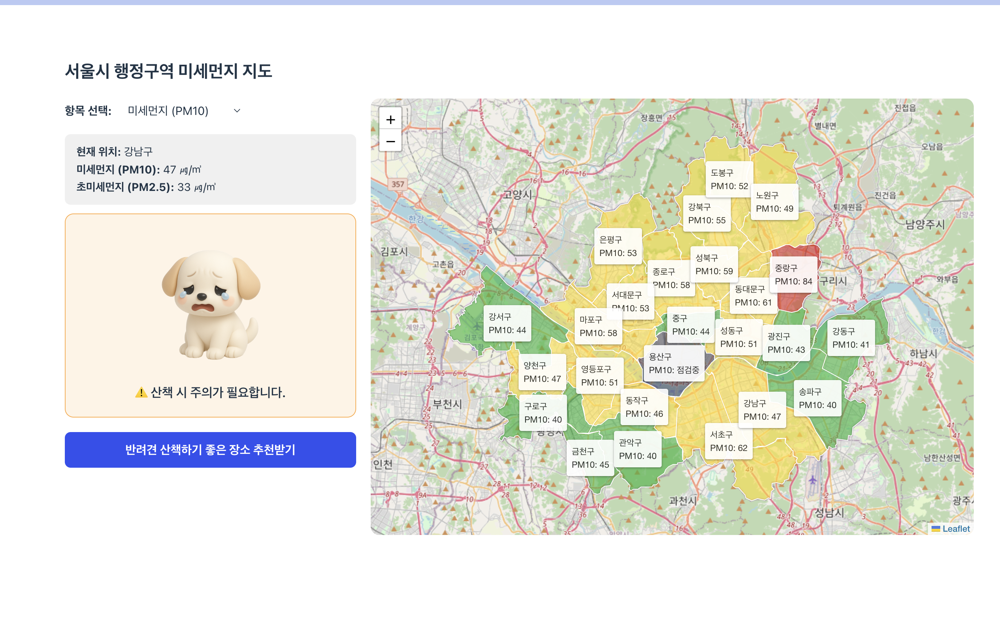
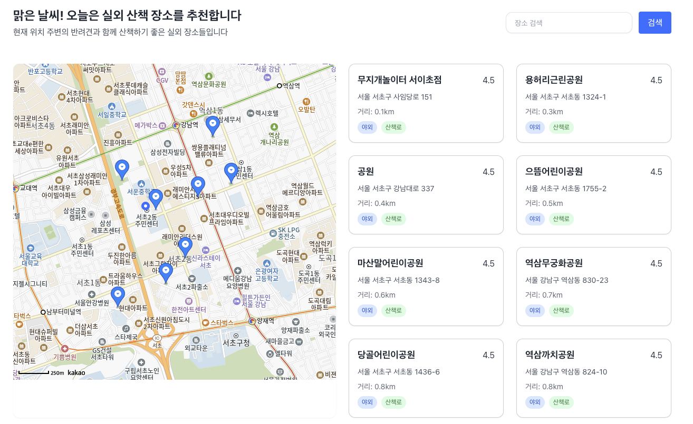
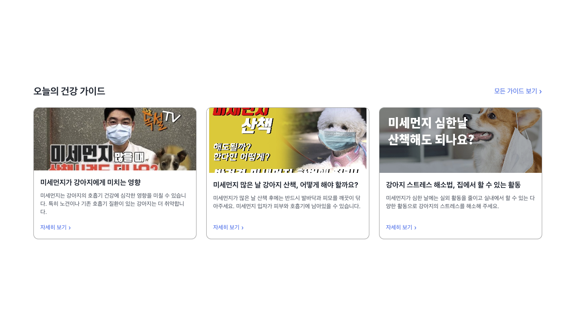
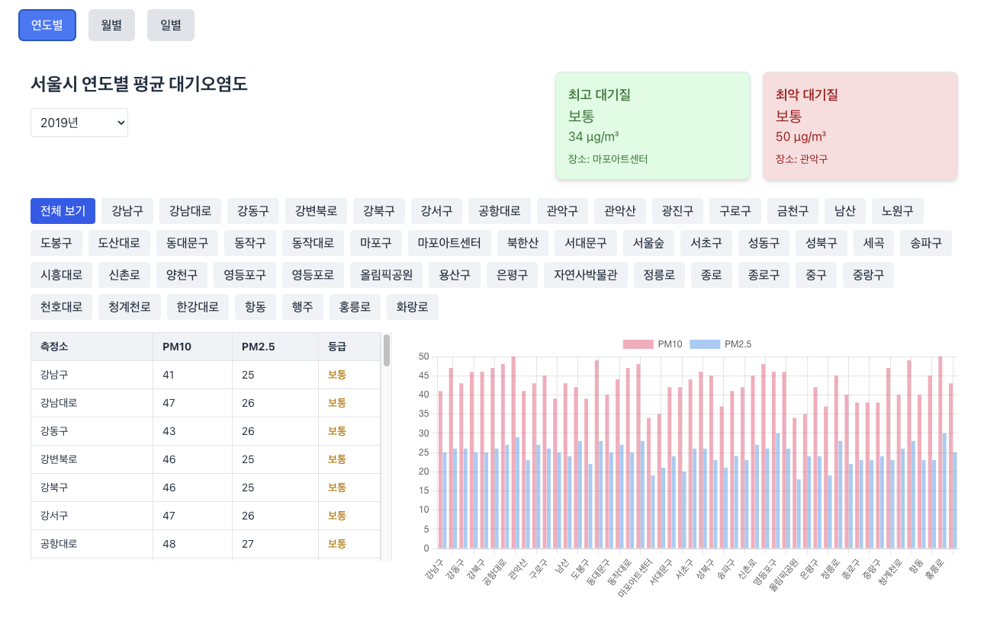

<h1 align="center">Graduation Project: 서울 반려견을 위한 미세먼지 정보 제공 플랫폼</h1>

<p align="center">
  
  
  
  
  
  
</p>

<p align="center">
  충대학교 졸업프로젝트 2025 <br/>
  반려견 보호자를 위한 미세먼지 정보 제공 웹 서비스
</p>

---

## 🧑‍🦰팀원
- **송수민**: Front-end  
- **장주형**: Front-end, 데이터셋 관리
- **정유진**: Back-end

---

## 📌 프로젝트 소개

**"서울 반려견을 위한 미세먼지 정보 제공 플랫폼"** 은
반려견 보호자가 서울시의 실시간 공기질 데이터를 한눈에 확인하고,
실내·실외 활동 장소와 전문가 가이드를 손쉽게 참고할 수 있도록 돕는 웹 서비스입니다.

* **직관적 지도 시각화**: 서울시 행정구역별 PM10·PM2.5 농도를 색상 등급으로 표시
* **위치 기반 추천**: 사용자의 GPS 정보로 가까운 산책 장소·애견카페 안내
* **전문가 건강 가이드**: 미세먼지 상황별 반려견 관리법을 카드 뉴스 형태로 제공
* **통계 시각화**: 연도별·월별 미세먼지 평균 데이터를 표와 차트로 확인 가능

---

## 🔥 주요 기능

### 1. 실시간 미세먼지 지도 시각화

* 서울시 구별 PM10/PM2.5 농도를 5개의 색상 등급(WHO 기준)으로 직관적으로 표시
* 지도 위 마커 · 행정구 레이어를 클릭하면 해당 구의 실시간 수치 확인 가능

### 2. 위치 기반 실외 산책 장소 추천

* 현재 위치를 기준으로 반경 내 안전한 산책 장소(공원/놀이터 등) 추천
* 장소명, 주소, 거리, 태그(야외/실외/공원 등), 평점 정보를 카드 형태로 제공

### 3. 실내 애견카페 정보 조회

* 반려견 동반 가능 카페 정보를 위치 기반으로 안내
* 운영시간, 전화번호, 견종 제한, 사용자 리뷰 등의 기본 정보 포함

### 4. 반려견 건강 행동 가이드 제공

* 대기 상태에 따라 “산책 자제” 또는 “실내 대체 활동”을 제안
* 수의사 검증 자료를 카드 뉴스 형식으로 시각화하여 쉽게 이해 가능

### 5. 미세먼지 통계 시각화

* 연도별·월별·일별 평균 PM10/PM2.5 값을 테이블과 Bar·Line 차트로 제공
* 연도로 데이터를 필터링하거나, 탭 전환으로 시계열 분석 가능

### 6. 사용자 리뷰 및 구독 기능 (추후 반영 예정)

* 애견카페 별 리뷰 등록·조회
* 미세먼지 임계값 알림 구독

---

## 📸 화면 예시

> 완성 후 실제 리포지토리 `/docs/screenshots/` 폴더에 이미지 파일을 저장한 뒤 상대경로로 삽입할 예정

#### 1. 실시간 미세먼지 지도 시각화



> * 좌측: 현재 위치(예: 강남구) 실시간 농도 및 “산책하기 좋은 날이에요!” 메시지
> * 우측: Leaflet 기반 서울시 행정구역별 PM2.5 수치 레이어

#### 2. 실외 산책 장소 추천 화면



> * 왼쪽: 카카오맵 마커로 표시된 산책 장소
> * 오른쪽: 장소 카드(이름, 거리, 태그, 평점) 리스트

#### 3. 반려견 건강 가이드



> * 카드 뉴스 형태로 제공되는 전문가 관리법(미세먼지 상황별 대처법)

#### 4. 미세먼지 통계 시각화



> * 연도별/월별/일별 탭 전환, 구별 평균값 표, Bar·Line 차트 렌더링

---

## 🚀 설치 및 실행

### 1. 백엔드 서버 (Flask)

```bash
# 1) 리포지토리 클론
git clone https://github.com/YourUsername/DogPollution.git
cd DogPollution/backend

# 2) 가상환경 생성 및 활성화 (선택)
python3 -m venv venv
source venv/bin/activate

# 3) 의존성 설치
pip install -r requirements.txt

# 4) 환경 변수 설정
#    backend/.env 파일에 아래 내용 추가
echo "KAKAO_API_KEY=YOUR_KAKAO_REST_API_KEY" > .env

# 5) 데이터베이스 초기화 (통계용)
python -c "import data.dust_history_api; data.dust_history_api.init_history_db()"

# 6) 서버 실행
export FLASK_APP=app
flask run --host=0.0.0.0 --port=5000
```

* 서버가 정상 기동되면 `http://localhost:5000` 에서 Swagger UI(`http://localhost:5000/docs/`)를 통해 API를 확인할 수 있습니다.

### 2. 프론트엔드 (React + Vite)

````bash
cd ../frontend

# 1) 패키지 설치
npm install

# 2) 환경 변수 설정
#    frontend/.env 파일에 아래 내용 추가
echo "VITE_API_BASE_URL=http://localhost:5000" > .env

# 3) 개발 서버 실행
npm run dev
```。

- 브라우저에서 `http://localhost:5173`에 접속하여 프론트엔드를 확인할 수 있습니다。

### 3. Docker(옵션)

```bash
# 프로젝트 루트에서 docker-compose 실행
docker-compose up --build
````

* 백엔드: `localhost:5000`
* 프론트엔드: `localhost:5173`

---

## 🛠️ 기술 스택

* **Backend**

  * Python 3.11, Flask 2.x
  * SQLite 3.x (데이터 저장)
  * Folium (지도 시각화), Requests (외부 API 호출)
  * Pytest (자동화 유닛/통합 테스트), Postman (API 컬렉션)

* **Frontend**

  * React 18, Vite 4
  * Tailwind CSS (스타일링)
  * Kakao Map SDK (지도/위치 검색)
  * Chart.js (통계 그래프)
  * Cypress (E2E 자동화 테스트)

* **Infrastructure**

  * Docker & Docker Compose
  * GitHub Actions (CI/CD 파이프라인 예시)

---

## 📖 API 문서

* Swagger UI (백엔드 실행 후):
  `http://localhost:5000/docs/`
* OpenAPI 스펙 JSON:
  `http://localhost:5000/apispec_1.json`

### 1. 미세먼지 데이터

#### 1-1. 서울 구별 미세먼지

**GET** `/api/dust/seoul/{pollutant}`

* **Path Parameter**

  * `pollutant`: `PM10` 또는 `PM25`

#### Response 예시

```json
{
  "pollutant": "PM10",
  "data": [
    { "region": "종로구", "value": 45 },
    { "region": "중구",   "value": 52 }
  ]
}
```

#### 1-2. 전국 도/광역시 평균 미세먼지

**GET** `/api/dust/province/{item_code}`

* **Path Parameter**

  * `item_code`: `PM10` 또는 `PM25`

#### Response 예시

```json
{
  "item_code": "PM25",
  "data": [
    { "region": "서울특별시", "value": 48 },
    { "region": "부산광역시", "value": 55 }
  ]
}
```

### 2. 전문가 조언

**GET** `/api/advice/{pollutant}/{value}`

* **Path Parameter**

  * `pollutant`: `PM10` 또는 `PM25`
  * `value`: 정수 미세먼지 농도

#### Response 예시

```json
{
  "pollutant": "PM10",
  "value": 85,
  "advice": "미세먼지 농도가 높습니다. 외출을 자제하세요."
}
```

### 3. 위치 기반 검색

#### 3-1. 산책 장소

**GET** `/api/walking_places?lat={lat}&lon={lon}&radius={radius}`

* **Query Parameter**

  * `lat`: 위도 (필수)
  * `lon`: 경도 (필수)
  * `radius`: 반경 km, 기본값 5 (선택)

#### Response 예시

```json
{
  "latitude": 37.5665,
  "longitude": 126.9780,
  "radius": 3,
  "places": [
    {
      "name": "서울숲",
      "latitude": 37.544,
      "longitude": 127.037,
      "description": "넓은 공원과 산책로"
    }
  ]
}
```

#### 3-2. 애견카페 정보

**GET** `/api/pet_cafe_info?lat={lat}&lon={lon}&radius={radius}`

* **Query Parameter**

  * `lat`: 위도 (필수)
  * `lon`: 경도 (필수)
  * `radius`: 반경 km, 기본값 5 (선택)

#### Response 예시

```json
{
  "latitude": 37.5665,
  "longitude": 126.9780,
  "radius_km": 5,
  "count": 2,
  "pet_cafes": [
    {
      "name": "도그카페 해피독",
      "latitude": 37.565,
      "longitude": 126.976,
      "restrictions": "소형견만 입장 가능",
      "operating_hours": "10:00 ~ 22:00",
      "price": "커피 5,000원",
      "distance_km": 0.27
    }
  ]
}
```

### 4. 애견카페 리뷰 & 별점

**GET** `/api/cafe_reviews/{cafe_name}`
**POST** `/api/cafe_reviews/{cafe_name}`

* **Path Parameter**

  * `cafe_name`: 카페 이름
* **POST Request Body 예시**

  ```json
  {
    "rating": 4,
    "review": "정말 좋아요!"
  }
  ```
* **GET Response 예시**

  ```json
  {
    "cafe_name": "CafeX",
    "count": 2,
    "reviews": [
      { "rating": 5, "review": "최고!",     "created_at": "2025-05-05T12:34:56" },
      { "rating": 3, "review": "보통이에요", "created_at": "2025-05-04T09:10:11" }
    ]
  }
  ```

### 5. 미세먼지 통계 API
#### 5-1. 서울시 구별 월별 통계
**GET** `/api/dust/history/monthly?year={YYYY}&pollutant={PM10|PM25}`

* **Query Parameter**
  * `year (필수)`: 조회할 연도, 예: 2025

  * `pollutant (필수)`: PM10 또는 PM25

#### Response 예시

```json
{
  "year": "2025",
  "pollutant": "PM10",
  "data": [
    {
      "region": "종로구",
      "monthly": [45.2, 50.1, 55.3, …, 40.0]
    },
    {
      "region": "중구",
      "monthly": [47.0, 49.2, 53.8, …, 42.5]
    }
    // …
  ]
}
```

#### 5-2. 서울시 구별 연별 통계
**GET** `/api/dust/seoul/history/yearly?start_year={YYYY}&end_year={YYYY}&pollutant={PM10|PM25}`

* **Query Parameter**
  * `start_year (필수)`: 시작 연도, 예: 2023

  * `end_year (필수)`: 종료 연도, 예: 2025
 
  * `pollutant (필수)`: PM10 또는 PM25

#### Response 예시

```json
{
  "start_year": "2023",
  "end_year": "2025",
  "pollutant": "PM25",
  "years": ["2023", "2024", "2025"],
  "data": [
    {
      "region": "종로구",
      "yearly": [48.5, 47.2, 46.1]
    },
    {
      "region": "중구",
      "yearly": [49.0, 48.0, 47.5]
    }
    // …
  ]
}
```

### 6. 구독(알림) 관리

**POST** `/api/customers`
**GET** `/api/customers`
**GET** `/api/customers/{customer_id}`
**PUT** `/api/customers/{customer_id}`
**DELETE** `/api/customers/{customer_id}`

* **POST `/api/customers` Request Body 예시**

  ```json
  {
    "name": "홍길동",
    "kakao_token": "사용자_토큰",
    "pollutant": "PM10",
    "threshold": 80
  }
  ```
* **GET `/api/customers` Response 예시**

  ```json
  {
    "subscribers": [
      { "id": 1, "name": "홍길동", "pollutant": "PM10", "threshold": 80 }
    ]
  }
  ```
* **GET `/api/customers/{id}` Response 예시**

  ```json
  {
    "id": 1,
    "name": "홍길동",
    "pollutant": "PM10",
    "threshold": 80,
    "active": true
  }
  ```
* **PUT `/api/customers/{id}` Request Body 예시**

  ```json
  {
    "threshold": 90,
    "active": false
  }
  ```
* **DELETE `/api/customers/{id}` Response 예시**

  ```json
  { "message": "구독 해지 완료" }
  ```

### 7. 카카오톡 알림 발송

**POST** `/api/notify/kakao`

* **Request Body 예시**

  ```json
  {
    "pollutant": "PM10",
    "value": 85
  }
  ```
* **Response 예시**

  ```json
  {
    "message": "알림 전송 성공",
    "result": { /* 카카오 API 응답 */ }
  }
  ```
