```mermaid
erDiagram
    USER {
      INTEGER id PK
      TEXT username
      TEXT email
      TEXT password_hash
      TEXT created_at
    }

    PET {
      INTEGER id PK
      INTEGER user_id FK
      TEXT name
      TEXT breed
      INTEGER age
      TEXT gender
      TEXT health_info
    }

    REVIEW {
      INTEGER id PK
      INTEGER user_id FK
      TEXT cafe_name  
      INTEGER rating
      TEXT review_text
      TEXT created_at
    }

    CAFE {
      INTEGER id PK
      TEXT name
      REAL latitude
      REAL longitude
      TEXT restrictions
      TEXT operating_hours
      TEXT price
      REAL rating
    }

    SUBSCRIPTION {
      INTEGER id PK
      INTEGER user_id FK
      TEXT pollutant
      REAL threshold
      TEXT kakao_id
      TEXT created_at
    }

    %% 관계 ì •ì˜
    USER ||--o{ PET : "has"
    USER ||--o{ REVIEW : "writes"
    CAFE ||--o{ REVIEW : "receives"
    USER ||--o{ SUBSCRIPTION : "subscribes"
```

# Backend README

> 서울 반려견을 위한 미세먼지 정보 제공 플랫폼 – **Backend** 

---

## 📂 프로젝트 구조(백엔드 관련)

```
backend/
├─ app/
│  ├─ __init__.py        # Flask 앱 초기화, Swagger, CORS, Blueprint 등록
│  ├─ config.py          # 환경변수/DB 설정
│  ├─ routes.py          # 메인(안내) 페이지
│  └─ error_handlers.py  # 예외 처리 표준화
├─ data/
│  ├─ air_service.py
│  ├─ air_summary_service.py
│  ├─ cafe_reviews.py
│  ├─ expert_advice.py
│  ├─ guides_service.py
│  ├─ home_service.py
│  ├─ kakao_notify.py
│  ├─ location_service.py
│  ├─ nationwide_dust_api.py
│  ├─ pet_cafe_info.py
│  ├─ pet_cafe_db.py
│  ├─ pet_profiles.py
│  ├─ products_service.py (demo)
│  ├─ reviews.py
│  ├─ scheduler.py
│  ├─ seoul_history_api.py
│  ├─ seoul_visualize.py
│  ├─ dust_visualize.py
│  └─ dust_history_api.py
├─ requirements.txt
└─ Dockerfile
```

---

## ✅ 요구사항

* Python 3.11+
* pip / venv (권장: 가상환경)
* (선택) Docker & Docker Compose

---

## ⚙️ 환경변수(.env)

다음 키가 필요합니다:

```
DEBUG=True
SECRET_KEY=...                # Flask 세션/보안 키
FRONTEND_URL=...              # CORS 허용할 프론트엔드 도메인

# Kakao 관련
KAKAO_ACCESS_TOKEN=...        # 카카오 액세스 토큰
KAKAO_ADMIN_KEY=...           # 카카오 REST API 키

# 공공데이터 API
SEOUL_API_KEY=...             # 서울시 대기질 API 키
AIRKOREA_SERVICE_KEY=...      # 에어코리아 API 키 (디코딩 키 권장)

# DB 경로
CUSTOMER_DB_PATH=...          # 구독자 DB 경로
REVIEWS_DB_PATH=...           # 리뷰 DB 경로
```

> `.env`는 절대 커밋하지 말고 `.env.example`로 키 이름만 공유하세요.

---

## 🚀 실행 방법

### 개발 모드 (Windows PowerShell 예시)

```powershell
# 가상환경 생성 및 활성화 (선택)
python -m venv .venv
. .venv\Scripts\Activate.ps1

# 패키지 설치
pip install -r requirements.txt

# 서버 실행
set FLASK_APP=backend/app
flask run --host=0.0.0.0 --port=5000

# Swagger UI: http://localhost:5000/docs/
```

### Docker 실행

```bash
# 이미지 빌드
docker build -t dogpollution-backend ./backend

# 컨테이너 실행
docker run --env-file ./backend/.env -p 5000:5000 dogpollution-backend
```

---

## 📖 API 요약 및 상세 예시

> 전체 스펙과 파라미터 상세는 Swagger(`/docs/`) 참고.

### 1) 대기질 조회

**서울 구별 조회**  
`GET /api/dust/seoul/<PM10|PM25>`

Response:
```json
{
  "pollutant": "PM10",
  "data": [
    { "region": "종로구", "value": 45 },
    { "region": "중구",   "value": 52 }
  ]
}
```

**전국 평균 조회**  
`GET /api/dust/province/<PM10|PM25>`

Response:
```json
{
  "pollutant": "PM25",
  "data": [
    { "region": "서울특별시", "value": 30 },
    { "region": "부산광역시", "value": 28 }
  ]
}
```

**전국 실시간 측정소 조회**  
`GET /api/dust/nationwide/realtime`

Response:
```json
{
  "count": 500,
  "items": [
    {
      "stationName": "종로구",
      "pm10": "45",
      "pm25": "22",
      "dataTime": "2025-06-13 14:00"
    }
  ]
}
```

---

### 2) 홈 요약 API

`GET /api/home/summary?lat={lat}&lon={lon}`

Response:
```json
{
  "region": "서울특별시",
  "pm10": 42,
  "pm25": 18,
  "air_quality": "보통",
  "advice": "실외 산책 가능하나 마스크 착용 권장",
  "recommended": [
    { "name": "서울숲", "distance_km": 1.2 },
    { "name": "남산공원", "distance_km": 2.5 }
  ]
}
```

---

### 3) 전문가 가이드

`GET /api/advice/{pollutant}/{value}`

Response:
```json
{ "advice": "미세먼지 농도가 높습니다. 외출을 자제하세요." }
```

---

### 4) 산책 장소 추천

`GET /api/walking_places?lat={lat}&lon={lon}&radius={km}`

Response:
```json
{
  "latitude": 37.5665,
  "longitude": 126.9780,
  "radius": 3,
  "places": [
    { "name": "서울숲", "latitude": 37.544, "longitude": 127.037 },
    { "name": "남산 공원", "latitude": 37.551, "longitude": 126.988 }
  ]
}
```

---

### 5) 애견카페 정보

`GET /api/pet_cafe_info?lat={lat}&lon={lon}&radius={km}`

Response:
```json
{
  "latitude": 37.5665,
  "longitude": 126.9780,
  "radius_km": 5,
  "count": 2,
  "pet_cafes": [
    {
      "name": "해피도그카페",
      "restrictions": "소형견만 입장 가능",
      "opening_hours": "10:00–20:00",
      "price": "₩10,000",
      "rating": 4.5
    }
  ]
}
```

---

### 6) 사용자 관리

- **GET** `/api/users/me` → 내 프로필 조회  
- **PUT** `/api/users/me` → 내 프로필 수정  
- **PUT** `/api/users/me/password` → 비밀번호 변경  
- **DELETE** `/api/users/me` → 계정 탈퇴  

---

### 7) 반려견 프로필

- **GET** `/api/users/me/pets` → 반려견 목록  
- **POST** `/api/users/me/pets` → 반려견 추가  
- **PUT** `/api/users/me/pets/{pet_id}` → 반려견 수정  
- **DELETE** `/api/users/me/pets/{pet_id}` → 반려견 삭제  

---

### 8) 리뷰 관리

- **GET** `/api/users/me/reviews` → 내 리뷰 조회  
- **POST** `/api/places/{place_id}/reviews` → 리뷰 작성  
- **PUT** `/api/reviews/{review_id}` → 리뷰 수정  
- **DELETE** `/api/reviews/{review_id}` → 리뷰 삭제  

---

### 9) 알림 설정

- **GET** `/api/users/me/notifications` → 알림 설정 조회  
- **PUT** `/api/users/me/notifications` → 알림 등록/수정  

---

## 🧰 트러블슈팅

* **Swagger UI 안 열림**: `flasgger` import 및 `Swagger(app, ...)` 설정 확인
* **에어코리아 403 오류**: `.env`의 `AIRKOREA_SERVICE_KEY`가 *디코딩 키*인지 확인
* **카카오 401 오류**: `.env`의 `KAKAO_ACCESS_TOKEN` 또는 `KAKAO_ADMIN_KEY` 확인
* **DB 파일 위치 문제**: `config.py`의 `SQLALCHEMY_DATABASE_URI` 절대경로 확인

---

# 📊 Backend ERD & Service Flows

## 1) ERD (개체-관계 다이어그램)



> 참고: `CAFE.name`과 `REVIEW.cafe_name`은 현재 문자열 기반 매핑(코드 기준). 추후 `cafe_id` FK로 정규화하면 무결성이 강화됩니다.

---

## 2) 서비스 흐름도 – 홈 요약(Home Summary)

> `/api/home/summary` 한 번으로 **WHO 등급 + 산책 가능/불가 + 추천(실외/실내)**까지 반환.

```mermaid
flowchart TD
    A[Client: /api/home/summary?lat&lon&pm10&pm25&sensitivity] --> B{pm10/pm25 직접 전달?}
    B -- 예 --> C[WHO 기준 등급/색상 계산]
    C --> D[민감도(sensitivity) 반영해 OK/CAUTION/AVOID]
    D --> E{lat/lon 존재?}
    E -- 예 --> F[실외 추천: walking_places.search_walking_places]
    E -- 예 --> G[실내 추천: pet_cafe_db.get_cafes_by_location]
    E -- 아니오 --> H[추천 비우기]
    F --> I[요약 payload 조립 + 캐시 헤더]
    G --> I
    H --> I

    B -- 아니오 --> J[air_summary_service.get_pm_summary(lat, lon)]
    J -->|서울| K[서울 25개 구 스냅샷 평균]
    J -->|그 외| L[AirKorea 시도별 최근 1주 평균]
    K --> C
    L --> C
```

---

## 3) 서비스 흐름도 – 정기 알림(Scheduler)

> 임계 초과 시 카카오 알림 발송.

```mermaid
flowchart TD
    S[Cron: APScheduler 매시 정각] --> S1[서울 스냅샷 평균(PM10/PM25) 수집]
    S1 --> S2[customer_db.get_subscribed_customers]
    S2 --> S3{평균 >= 각 구독자의 threshold?}
    S3 -- 예 --> S4[kakao_notify.send_kakao_alert]
    S3 -- 아니오 --> S5[Skip]
    S4 --> S6[로그/결과 기록]
    S5 --> S6
```

---

## 4) 서비스 흐름도 – 카페 리뷰(인증 라우트)

> `@login_required`가 적용된 기본 CRUD.

```mermaid
flowchart TD
    R1[Client: GET/POST /api/cafe_reviews/<cafe_name>] --> R2{로그인 세션?}
    R2 -- 아니오 --> R3[401 Unauthorized]
    R2 -- 예 --> R4{GET or POST?}
    R4 -- GET --> R5[SELECT rating, review_text, created_at FROM reviews WHERE cafe_name]
    R4 -- POST --> R6[유효성 검사(rating int, review text)]
    R6 -->|OK| R7[INSERT INTO reviews]
    R6 -->|오류| R8[400 Bad Request]
    R5 --> R9[JSON 반환]
    R7 --> R10[201 Created]
```
